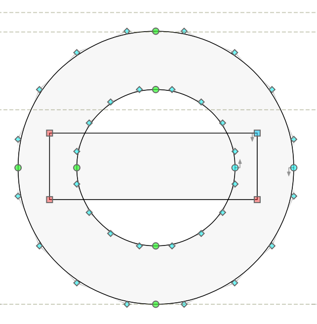
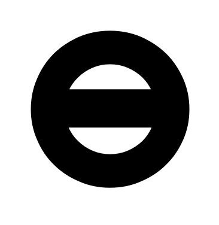
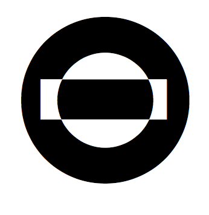
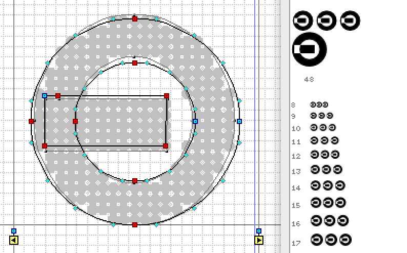
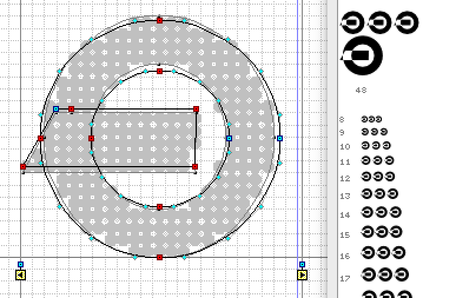
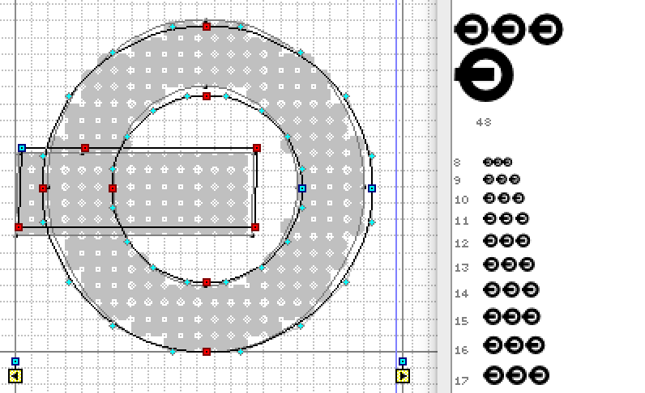
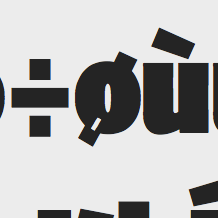

## EvenOddTT

Example font for testing of the Mac OS X 10.11.4 rendering of TrueType-flavored fonts with overlapping contours. 

*Prepared 2016-04-13 by Adam Twardoch, licensed under [CC0 / Public Domain Dedication](https://creativecommons.org/publicdomain/zero/1.0/)*

### Non-zero-winding vs. even-odd-winding TrueType glyph rendering

The [Apple TrueType spec](https://developer.apple.com/fonts/TrueType-Reference-Manual/RM01/Chap1.html) says: 

*The direction of a glyph's contours is used to determine which portions of the shape defined by the contours is filled(black) and which portions are unfilled (white). In making this determination, TrueType uses the non-zero winding number rule.*

and reaffirms that [elsewhere](https://developer.apple.com/fonts/TrueType-Reference-Manual/RM02/Chap2.html#distinguishing) with examples. 

However, in a [chapter about AAT](https://developer.apple.com/fonts/TrueType-Reference-Manual/RM06/Chap6AATIntro.html), it is stated: 

*One addition to the 'glyf' table is the designation of glyphs with overlapping contours. This is not needed for rendering by TrueType scalers, but is needed when a TrueType font must be converted to a Type 1 Font and rendered on a printer under some Level 2 PostScript implementations. Since the introduction of the original 'glyf' format, Level 2 Postscript has been introduced. Some printers that incorporate Level 2 Postscript use an even-odd fill algorithm for Type 1 fonts rather than the non-zero winding number fill that was used in previous PostScript implementations. Therefore, to accurately translate a TrueType font to a Type 1 font for use on the Level 2 printers, glyphs with overlapping contours must be simplified, so it is necessary to know which glyphs have overlapping contours. Glyphs that are not properly flagged will be rendered on these printers with white space holes where the contours overlap. For simple glyphs, you should set bit 6 of the first Outline Flag byte to 1 if the unhinted glyph outline has overlapping contours or if variation controls or hinting controls can ever cause any of the contours to overlap. Otherwise this bit should be set to 0.*

The bit 6 of the Outline Flag is otherwise mentioned as “reserved” in both the [Apple spec](https://developer.apple.com/fonts/TrueType-Reference-Manual/RM06/Chap6glyf.html) and the [OpenType spec](https://www.microsoft.com/typography/otspec/glyf.htm). 

### The EvenOddTT sample font and the problem of Mac OS X 10.11.4

The font **EvenOddTT** is a tiny TrueType-flavored OpenType font which contains one glyph (`O`) that is drawn with 3 contours, like so: 

The `-orig.ttf` version has just this. I have also created a `-mod.ttf` version of the sample font which (I believe) has the bit 6 set to 1 in the affected glyph. 

The rendering of the glyph that is drawn in such a way is expected to be: 

and this is how this glyph is rendered in FreeType and in Microsoft Windows, and also, if the special bit has been set, in macOS Sierra.

However, in Mac OS X 10.11.4 El Capitan CoreText renderer, the glyph is rendered “inverted”, as follows: 

which suggests that Mac OS X 10.11.4 may be using the even-odd-winding rule. If the special bit is unset, the same rendering happens in macOS 10.12.1 Sierra.

This is confirmed by comparing how the hinted outline is rendered in FontLab Studio 5 using: 
* the Microsoft font rasterizer:

* the current Apple rasterizer:

#### Attachments

* [EvenOddTT-orig.ttf](EvenOddTT-orig.ttf) has the original glyph outline
* [EvenOddTT-mod.ttf](EvenOddTT-mod.ttf) has bit 6 of the flags field of the first contour in the `O` glyph set to 1 — but it does not seem to have any influence over the Apple rasterizer in Mac OS X 10.11 El Capitan, but it **does** affect macOS Sierra. In MacOS 10.12 Sierra, the situation is different: *EvenOddTT-orig.ttf* renders as it did (with the overlaps visible as “white”) while *EvenOddTT-mod.ttf* renders as expected, with the overlaps invisible (except in smaller sizes “ghost lines” being visible).

### Other places where the “inverting” problem is seen

### Hoefler Text

The same “inverting” problem occurs not only with my sample font but also with the **Hoefler Text** font v8.0d2e1 which ships with Mac OS X 10.11.4. 

In all four styles of Hoefler Text, the glyphs for ĦӨө (U+0126 U+04E8 U+04E9) render with the “inverted” overlaps — when the standard OS X CoreText renderer is used. In Hoefler Black, the glyph for ѐ (U+0450) renders with a “black” counter, which may or may not be related to this problem.  

Here’s the glyph `uni04E8` (Ө) from Hoefler Text Regular as rendered in:
* the Microsoft font rasterizer:

* the current Apple rasterizer:

* the “old” monochrome Apple rasterizer: 

However, other overlapping glyphs in Hoefler Text do not show the “inverting” problem. They still manifest the other annoying issue i.e. that for composite glyphs made from overlapping components such as `hbar`, the Apple font renderer draws a thin visible “halo” around each component: 

But even if the `hbar` glyph is decomposed (i.e. turned into a glyph with overlapping contours), the “inverting” problem does not occur. 

It seems that the “inverting” problem is not really just a non-zero vs. even-odd winding. Apple seems to be doing some “smart” (in fact, not so smart) guesses. Compare the three versions of a glyph that only differ in where the leftmost nodes of the rectangular contour are placed (the contour directions are always identical). The black rendering in the corner is the result of the Apple rasterizer: 

### Skia

The same problem manifests itself in Skia, where the `oslash` glyph in the bolder variations has a special contour that is “hidden” inside the stem (and should be rendered “black”, but it ends up being rendered as “white”:

